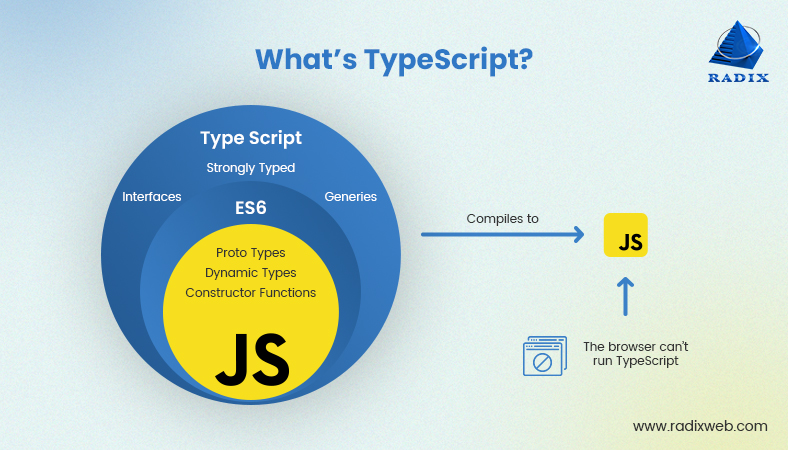

# Creando un proyecto de Angular

```sh
ng n <nombre-del-proyecto>
ng n primeros_pasos
```

## Instalar las depedencias
Normalmente las dependencias del proyecto que se esta desarrollando no se comparten. (node_modules)

```sh
npm i # npm install
# Lee el package.json y crea la carpeta de las depdencias (node_modules)
``` 

## Para saber que scripts tengo en el package.json

```sh
npm run 
```

## Levantar el servidor de desarrollo

```sh
npm start # npm run start
```  

## Detener el servidor de desarrollo

Ctrl + C

## DevTools Angular

<https://angular.io/guide/devtools>

### Chrome

<https://chromewebstore.google.com/detail/angular-devtools/ienfalfjdbdpebioblfackkekamfmbnh>

### Firefox

<https://addons.mozilla.org/en-GB/firefox/addon/angular-devtools/>


## Extensiones de Visual Studio

* Material Icon Theme (PKief.material-icon-theme)
* Angular Language Service (Angular.ng-template)
* Angular Snippets (Version 16) (johnpapa.Angular2)
* Auto Close Tag (formulahendry.auto-close-tag)
* Auto Rename Tag (formulahendry.auto-rename-tag)
* Shades of Purple (ahmadawais.shades-of-purple)
* EditorConfig for VS Code (EditorConfig.EditorConfig)
* Todo Tree (Gruntfuggly.todo-tree)


## TypeScript

<https://www.typescriptlang.org/>

```sh
npm install typescript -g
``` 

### Verificar la versión y si tengo instalado Typescript

```sh
tsc --version
```




## Creando un componente

```sh
ng generate component <carpeta>/<nombre-componente>
ng generate component componentes/formularios
ng g c componentes/formularios -d # Simula pero no crea los archivos
ng g c componentes/formularios 
```

## Subiendo el proyecto a la nube

## Backend para hacer pruebas de peticiones asincronicas con ANGULAR

## JSON-SERVER

<https://github.com/typicode/json-server/tree/v0>

```sh
npm install -D json-server@0.17.4
```

## Configurar el script

```json
"scripts": {
    "server": "json-server --watch data/db.json --port 8080"
  },
```

## Creamos la carpeta y el archivo data/db.json

```json
{
  "usuarios": [
    { "id": 1, "nombre": "José", "edad": 22 },
    { "id": 2, "nombre": "Pedro", "edad": 23 },
    { "id": 3, "nombre": "Juan", "edad": 25 }
  ],
  "productos": [
    { "id": 1, "nombre": "Linterna", "precio": 233.33 },
    { "id": 2, "nombre": "Disco", "precio": 133.33 },
    { "id": 3, "nombre": "Memoria", "precio": 433.33 },
    { "id": 4, "nombre": "Monitor", "precio": 633.33 }
  ]
}
```

## Extensión para visiualizar mejor los json

<https://chromewebstore.google.com/detail/json-viewer-pro/eifflpmocdbdmepbjaopkkhbfmdgijcc>

## RxJS

<https://rxjs.dev/guide/overview>

## Mockapi

<https://mockapi.io/projects>
